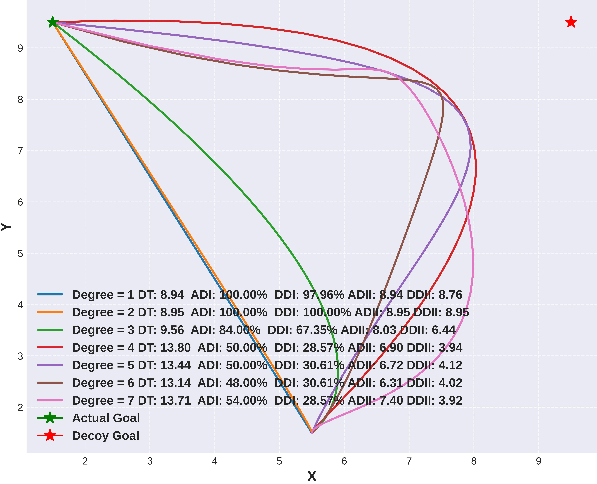

# Agent Deception Via Polynomial Path Planning
 
## Overview
This project develops a deceptive polynomial path planning algorithm, with the
objective of guiding an agent towards a target destination while simultaneously
misleading an adversarial observer into predicting a false goal. This approach
is designed to obscure the agent's true goal by strategically navigating in a deceptive manner.

 
*Figure 1. Illustration of the deceptive polynomial path planner pipeline. Our approach is designed to address factors of deception including distance from each goal (top left and right), movement direction (bottom left), and the apparent goal of the agent after given the agent's trend.*


*Figure 2. Visualization of deceptive paths generated by our deceptive polynomial path planner using different polynomial degrees. Each path is evaluated using the following metrics: Distance Traveled (DT), Alignment Deception Index (ADI), Distance Deception Index (DDI), Alignment Deception Impact Index (ADII), and Distance Deception Impact Index (DDII). Lower values of ADI, DDI, ADII, and DDII indicate higher deceptiveness, while lower DT values indicate greater efficiency.*

### Authors

- Nolan B. Gutierrez [](https://scholar.google.com/citations?user=2KSNiPQAAAAJ&hl=en)
- Brian M. Sadler [](https://scholar.google.com/citations?user=s9eCQn4AAAAJ&hl=en)
- William J. Beksi [](https://scholar.google.com/citations?user=lU2Z7MMAAAAJ&hl=en)

## Citation
If you find this project useful, then please consider citing our project.  
```bibtex
@misc{gutierrez2025agent,
  author       = {Gutierrez, Nolan and Beksi, William J. and Sadler, Brian M.},
  title        = {Agent Deception Via Polynomial Path Planning},
  year         = 2025,
  howpublished = {\url{https://github.com/robotic-vision-lab/Agent-Deception-Via-Polynomial-Path-Planning.git}},
}
```

## Installation

#### Requirements

- Ubuntu 22
- Python 3.10.9

#### Setting up your environment

Set up your environment and install the required dependencies:

1. Install Python 3.10 on your Ubuntu 22 system. You can use pyenv to manage multiple Python versions on your machine.

2. Clone the repository:
together with 
   ```bash
   git clone https://github.com/robotic-vision-lab/Agent-Deception-Via-Polynomial-Path-Planning.git
   cd Agent-Deception-Via-Polynomial-Path-Planning
   ```


3. Create a virtual environment:

   ```bash
   python3.10 -m venv venv
   ```
   
4. Activate the virtual environment
   ```bash
   source venv/bin/activate
   ```
5. Install the required Python packages:
   ```bash
    pip install -r requirements.txt
   ```


## Usage

To run the deceptive polynomial path planning algorithm, follow these instructions:

1. Ensure that you have activated your virtual environment and installed the required dependencies from the `requirements.txt` file.

2. Use the following command to execute the `test.py` script with the desired input parameters:

```bash
for i in {1..10}; do python deceptive_polynomials/test.py --degree 5 --beta 0  --alternative_goals "[[9.5,9.5]]" --points "[[9.5,9.5]]" --circle_location "(7,-8)" --start_location [5.5,1.5] --goal [1.5,9.5] --circle_beta 100   --short_on --obs_on  --title "Exg_Align_Coeff_Dist_Smooth_\$i"  --ambiguity_on --alt_angle_beta 1000  --curvature_on  --reg_beta 100000 ; done
```
The command above runs the algorithm 10 times with the specified input parameters. You can modify the input parameters as needed to suit your specific use case.

Here's a brief explanation of the input parameters:

- --degree: Degree of the polynomial to be fitted
- --beta: Regularization parameter
- --alternative_goals: Alternative goal locations
- --points: Points on the trajectory
- --circle_location: Location of the circle used in the path planning
- --start_location: Start location of the robot/vehicle
- --goal: The true goal location
- --circle_beta: Circle constraint regularization parameter
- --short_on: Enable/disable the shortest path constraint
- --obs_on: Enable/disable the obstacle constraint
- --title: Title for the output files
- --ambiguity_on: Enable/disable the ambiguity constraint
- --alt_angle_beta: Alternative angle regularization parameter
- --curvature_on: Enable/disable the curvature constraint
- --reg_beta: Regularization parameter for the trajectory fitting
- --point_beta: Point constraint regularization parameter
- --traj_folder_prefix: Prefix for the trajectory folder name


After each run, the resulting trajectories are stored in the
`trajectories/` folder by default. To visualize all of the trajectories using matplotlib,
execute the following command:
```bash
python deceptive_polynomials/utils/plot_trajectories --folder trajectories
``` 

## License


[](https://github.com/robotic-vision-lab/Agent-Deception-Via-Polynomial-Path-Planning/blob/main/LICENSE)

## References

This project utilizes code from the following project:  

* InformedRRTStar     https://github.com/AtsushiSakai/PythonRobotics/tree/master

## Acknowledgements

This project was made possible through the support of the Graduate Assistance in
Areas of National Need (GAANN) Fellowship, a program funded by the U.S.
Department of Education. We are grateful for the financial assistance provided
by the GAANN Fellowship, which enabled us to develop and advance this research.
This work was initiated during an internship at the U.S. Army Combat
Capabilities Development Command Army Research Laboratory under the DoD's
HBCU/MI Summer Research Internship Program, where early development and
evaluation of the deceptive polynomial path planner began.


