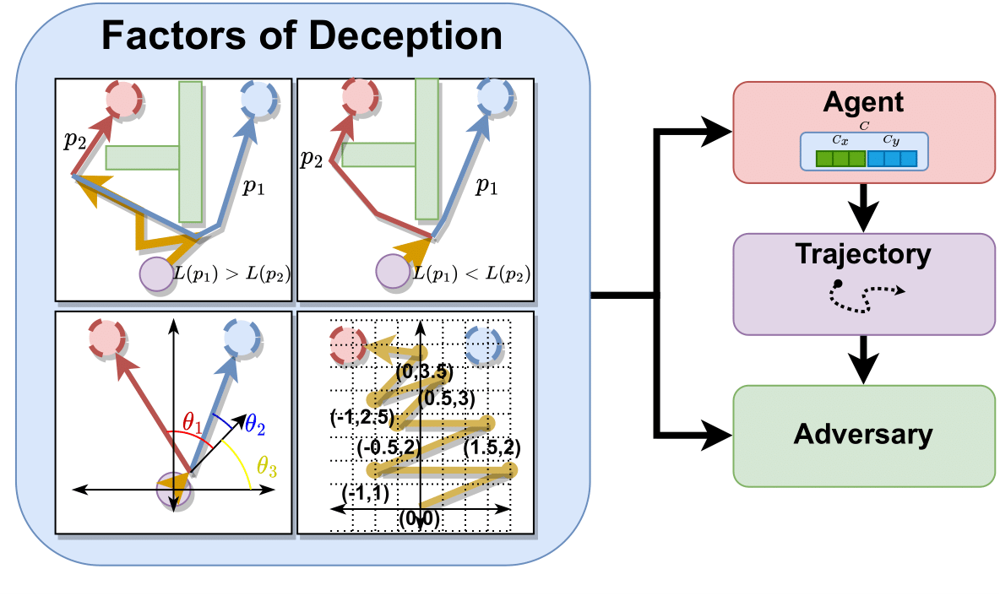

## Agent Deception via Polynomial Path Planning
 
### Overview
Deceptive path planning enables an intelligent agent to conceal its true
intentions while appearing to pursue an alternative goal. Deception is a
crucial tool for misleading and confusing adversaries, especially in sectors
such as security, transportation, and surveillance, where the ability to
conceal true intentions may lead to significant advantages.  This repository
contains the implementation of our deceptive polynomial path planner (DPPP). As
shown in Figure 1, DPPP generates deceptive behaviors that guide an agent
towards a target destination while simultaneously misleading an adversarial
observer into predicting a false goal. 

<p align="center">

</p>
Figure 1: Overview of DPPP. The left side shows the deception factors used by
the planner, including goal/decoy proximity (top row), goal/decoy alignment
(bottom left), and the agent's apparent goal inferred from trajectory trends.
As shown on the right, an adversary must consider these factors when
determining the agent's intentions, while the agent strategically exploits
these factors to generate deceptive plans.

### Authors

- Nolan B. Gutierrez [](https://scholar.google.com/citations?user=2KSNiPQAAAAJ&hl=en)
- Brian M. Sadler [](https://scholar.google.com/citations?user=s9eCQn4AAAAJ&hl=en)
- William J. Beksi [](https://scholar.google.com/citations?user=lU2Z7MMAAAAJ&hl=en)

### Citation

If you find this project useful, then please consider citing our work.

```bibtex
article{gutierrez2025agent,
  title={Agent Deception via Polynomial Path Planning},
  author={Gutierrez, Nolan B and Sadler, Brian M and Beksi, William J},
  journal={Engineering Applications of Artificial Intelligence},
  volume={159},
  pages={111205},
  year={2025}
}
```

### Installation

#### Requirements

- Ubuntu 22
- [Miniconda3](https://www.anaconda.com/docs/getting-started/miniconda/install#quickstart-install-instructions)

#### Environment Setup
After installing Miniconda3, create a new conda environment with Python 3.10:

    $ conda create -n deception_env python=3.10 -y
    $ conda activate deception_env

Then, clone the repository:

    $ git clone https://github.com/robotic-vision-lab/Agent-Deception-Via-Polynomial-Path-Planning.git
    $ cd Agent-Deception-Via-Polynomial-Path-Planning

Finally, install the required Python packages:

    $ pip install -r requirements.txt

### Getting Started 
After installing the environment, you can test DPPP by running one of the
example configurations:

    $ python deceptive_polynomials/test.py --degree 5 --start_location [5.5,0] --goal [1.5,9.5] --alternative_goals "[[9.5,9.5]]" --short_on --ambiguity_on --reg_beta 100000 --curvature_on --beta 100 --reg_on --alt_angle_beta 1000

See the  [Usage](#usage) section below for more options.

### Usage
For batch execution or parameter sweeps, try the following example:

    $ for i in {1..10}; do python deceptive_polynomials/test.py --degree $i --beta 0 --alternative_goals "[[9.5,9.5]]"  --circle_location "(7,-8)" --start_location [5.5,1.5] --goal [1.5,9.5] --circle_beta 100   --short_on --obs_on  --title "Degree_\$i"  --ambiguity_on --alt_angle_beta 1000  --curvature_on  --reg_beta 100000 ; done

This command runs DPPP 10 times, within a shell loop, with varied output
titles. It is useful for generating multiple trajectories under different
configurations. The command was used to generate the deceptive paths shown in
Figure 2.  

<p align="center">

</p>
Figure 2: Visualization of deceptive paths generated by DPPP using different
polynomial degrees. Each path is evaluated using the following metrics:
distance traveled (DT), alignment deception index (ADI), distance deception
index (DDI), alignment deception impact index (ADII), and distance deception
impact index (DDII). Lower values of ADI, DDI, ADII, and DDII indicate higher
deceptiveness, while lower DT values indicate greater efficiency.

You can modify the input parameters to suit your specific use case or scenario.
Here's a brief explanation of the input parameters:

```
--degree: Degree of the polynomial to be fitted
--beta: Regularization parameter
--alternative_goals: Alternative goal locations
--circle_location: Location of the circle used in the path planning
--start_location: Start location of the robot/vehicle
--goal: True goal location
--circle_beta: Circle constraint regularization parameter
--short_on: Enable/disable the shortest path constraint
--obs_on: Enable/disable the obstacle constraint
--title: Title for the output file
--ambiguity_on: Enable/disable the ambiguity constraint
--alt_angle_beta: Strength of the alignment constraint with the decoy goal (encourages trajectories to appear goal-aligned)
--curvature_on: Enable/disable the curvature constraint
--reg_beta: Regularization parameter for the trajectory fitting
--point_beta: Point constraint regularization parameter
--traj_folder_prefix: Prefix for the trajectory folder name
```

After each run, the resulting trajectories are stored in the `trajectories/`
folder by default. To visualize all of the trajectories (e.g., Figure. 2) using
matplotlib, execute the following command:

    $ python deceptive_polynomials/utils/plot_trajectories.py --folder trajectories

### References

This project utilizes code from the following project:  

* PythonRobotics    https://github.com/AtsushiSakai/PythonRobotics

### Acknowledgments

This research was supported by the U.S. Department of Education's Graduate
Assistance in Areas of National Need (GAANN) Fellowship. Initial development
and early evaluation of DPPP was conducted during an internship at the U.S.
Army Combat Capabilities Development Command Army Research Laboratory (DEVCOM
ARL), as part of the DoD's HBCU/MI Summer Research Internship Program. 

### License

[](LICENSE)
